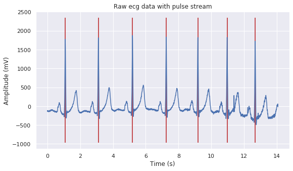

# visualize_split_BioVid
Here is a sample of the BioVid heat pain dataset. The datasets were achieved by experiments in the lab. There are 87 subjects in Part A and 86 ones in Part B. The 100 signal files were generated from each subject. The 8700 samples in Part A and 8600 in Part B were analyzed. We applied filters and Pan Tompkins algorithm to detect R reaks of ECG, and removed noises by the amplitude of the R waves.

